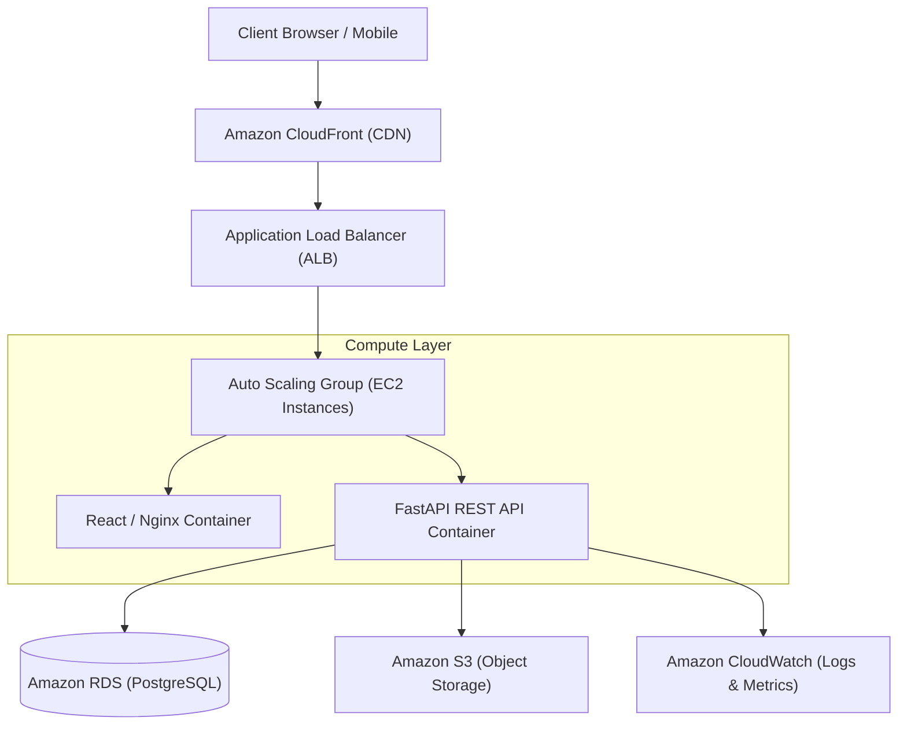

# CloudTask Pro
### Cloud-Native Multi-Tenant Project Management & Collaboration Platform

CloudTask Pro is a scalable, cloud-native project management system engineered with a decoupled microservice architecture. It provides multi-tenant workspaces, interactive Kanban boards, calendar scheduling, real-time activity feeds, role-based access control, and automated infrastructure deployment on AWS.

The platform simulates a production-grade transition from containerized services to a highly available, auto-scaled cloud deployment.

---

## Project Overview

CloudTask Pro was designed to solve the challenges of team collaboration, task visibility, and cloud resource management:

- Multi-tenant workspace partitioning with strict data isolation
- Task lifecycle management featuring interactive Kanban boards and calendar timelines
- Granular Role-Based Access Control (RBAC) across Workspace Owner, Admin, and Member roles
- Production-ready cloud infrastructure supporting auto-scaling, managed database persistence, and CDN delivery

---

## Core Features

### Task and Project Management
- Dynamic Kanban boards with drag-and-drop task workflows
- Comprehensive task attributes: priority levels, custom labels, assignees, and due dates
- Calendar and timeline views for sprint scheduling and milestone tracking
- Project health dashboards with real-time completion analytics

### Multi-Tenant Collaboration
- Workspace creation and isolation with member invitations
- Team directory management with role and permission assignments
- Task-level threaded comments and real-time activity audit logs
- System notifications for assignments, status updates, and mentions

### Security and Governance
- Stateless JWT authentication with secure password hashing (bcrypt)
- Role-based authorization enforced at API dependencies
- Quota and rate-limit enforcement across subscription tiers
- Centralized audit logging for compliance and administrative monitoring

---

## Overall Architecture



---

## Technology Stack

| Layer | Technologies |
|---|---|
| Frontend | React 18, TypeScript, Tailwind CSS, Vite |
| Backend | FastAPI, Python 3.12, Pydantic, SQLAlchemy |
| Database & ORM | PostgreSQL, Alembic (Database Migrations) |
| Containerization | Docker, Docker Compose, Multi-stage Nginx builds |
| Cloud Platform | Amazon Web Services (AWS) |
| Compute | Amazon EC2, Auto Scaling Groups (ASG) |
| Storage & CDN | Amazon S3, Amazon CloudFront |
| Load Balancing | AWS Application Load Balancer (ALB) |
| Monitoring | Amazon CloudWatch, Structured JSON Logging |

---

## Cloud Infrastructure Highlights

- **Stateless Application Layer**: Backend services verify cryptographically signed JWT tokens without local session persistence, enabling horizontal auto-scaling across EC2 instances.
- **Database Decoupling**: Migrated from local SQLite to Amazon RDS PostgreSQL in private VPC subnets with automated snapshots and read-replica readiness.
- **Static Asset Offloading**: Compiled frontend bundles are hosted on Amazon S3 and distributed via CloudFront edge locations, reducing server compute overhead.
- **High Availability & Health Checks**: Dedicated `/health` endpoints allow the Application Load Balancer to automatically isolate and replace unhealthy nodes.
- **Optimized Container Builds**: Multi-stage Docker packaging separates development dependencies from production artifacts, minimizing container attack surface and image size.

---

## Project Structure

```text
cloudtask-pro/
├── backend/
│   ├── app/
│   │   ├── api/        # FastAPI REST endpoints and route handlers
│   │   ├── core/       # Security, JWT tokens, and configuration
│   │   ├── db/         # SQLAlchemy connection and session management
│   │   ├── models/     # Relational database models
│   │   ├── schemas/    # Pydantic request and response schemas
│   │   └── services/   # Business logic and domain operations
│   ├── alembic/        # Schema migration scripts
│   ├── tests/          # Pytest automated test suite
│   └── Dockerfile      # Backend container definition
├── frontend/
│   ├── src/
│   │   ├── app/        # Pages, layouts, and route components
│   │   ├── styles/     # Tailwind CSS tokens and themes
│   │   └── lib/        # API client and local state helpers
│   ├── nginx.conf      # Reverse proxy configuration
│   └── Dockerfile      # Multi-stage production build
├── docker-compose.yml  # Local multi-container orchestration
└── README.md
```

---

## Local Development

1. **Clone the repository**
   ```bash
   git clone https://github.com/jayshah161204/cloudtask-pro.git
   cd cloudtask-pro
   ```

2. **Configure environment variables**
   ```bash
   cp backend/.env.example backend/.env
   ```

3. **Start services with Docker Compose**
   ```bash
   docker compose up --build
   ```

   - Frontend: `http://localhost:3000`
   - Backend API: `http://localhost:8000`
   - Interactive API Docs: `http://localhost:8000/docs`
